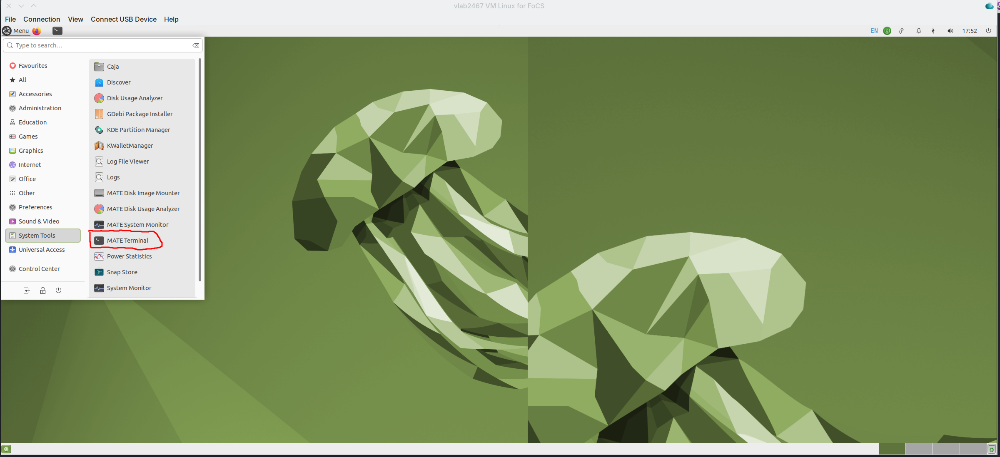

## How to prepare the LibAAS machine

*  Open the terminal 
*  Write the following command 

```
curl -fsSL https://gdv.github.io/foundationsCS/bin/install-FoCS.sh | sh
```

*  Close and reopen the terminal
*  Write the following command

```
pixi global install notebook pandas sqlite pandas jupyterlab sqlalchemy pyarrow fastparquet
```

Then you are ready to go.

This work is licensed under 
<a href="https://creativecommons.org/licenses/by/4.0/">CC BY 4.0</a>
